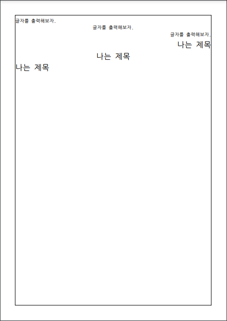
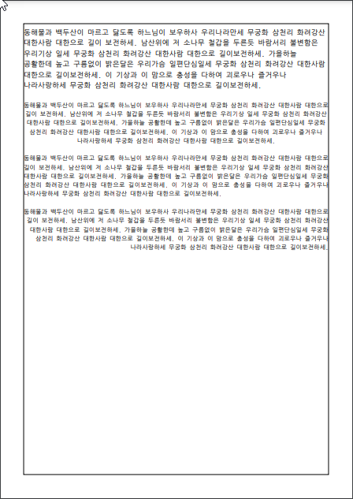
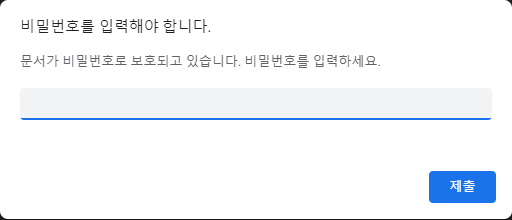

## PDFBOX  라이브러리 사용하기

Apache PDFBox ® 라이브러리는 PDF 문서 작업을위한 오픈 소스 Java 도구입니다. 이 프로젝트를 통해 새 PDF 문서를 만들고 기존 문서를 조작하고 문서에서 콘텐츠를 추출 할 수 있습니다. Apache PDFBox에는 여러 명령 줄 유틸리티도 포함되어 있습니다. Apache PDFBox는 Apache License v2.0에 따라 게시됩니다.

 PDFBOX(Apache) 라이브러리 다운로드 : [pdfbox.apache.org/download.cgi](https://pdfbox.apache.org/download.cgi)


자바에서 pdfbox를 사용하기 위해서 라이브러리를 포함해야 한다. 다운로드받아 Build Path에 추가하거나 maven을 사용한다면 dependencies에 다음을 추가해주면 된다.

```xml
		<!-- pdf BOX -->
		<dependency>
			<groupId>org.apache.pdfbox</groupId>
			<artifactId>pdfbox</artifactId>
			<version>2.0.24</version>
		</dependency>
```


### 1. 빈페이지를 작성해 보자

```java
package pdfbox.example;

import java.io.File;
import java.io.IOException;

import org.apache.pdfbox.pdmodel.PDDocument;
import org.apache.pdfbox.pdmodel.PDPage;

public class EX01_CreateEmptyPdf  {
	public static void main(String[] args) {
		String destFileName = "pdf_example/EX01_CreateEmptyPdf.pdf";
		try (PDDocument document = new PDDocument()) {// 문서작성
			PDPage blankPage = new PDPage(); // 페이지 작성
			document.addPage(blankPage); // 페이지 추가
			document.save(destFileName); // 저장
			System.out.println(destFileName + "PDF 작성완료");
		} catch (IOException e) {
			e.printStackTrace();
		}
		chromeView(destFileName); // 작성된 문서보기
	}

	// 저장된 문서 크롬으로 보기
	private static void chromeView(String destFileName) {
		String chrome = "C:\\Program Files (x86)\\Google\\Chrome\\Application\\chrome.exe";
		try {
			File file = new File(destFileName); // 파일 객체 생성
			new ProcessBuilder(chrome, file.getAbsolutePath()).start(); // 프로세스 시작
		} catch (IOException e) {
			e.printStackTrace();
		}
	}
}
```

결과를 확인해보자. 다음과 같이 문서가 생겼으며 속성을 확인해 보면 아래와 같다.

<p align="center"></p>


### 2. HelloWorld!!! PDF

페이지 크기를 A4(210*297) 크기 문서에 "Hello World!!!"를 출력해보자.

```java
import java.io.File;
import java.io.IOException;

import org.apache.pdfbox.pdmodel.PDDocument;
import org.apache.pdfbox.pdmodel.PDPage;
import org.apache.pdfbox.pdmodel.PDPageContentStream;
import org.apache.pdfbox.pdmodel.common.PDRectangle;
import org.apache.pdfbox.pdmodel.font.PDFont;
import org.apache.pdfbox.pdmodel.font.PDType1Font;

public class EX02_CreatePDF2 {
	public static void main(String[] args) {
		String destFileName = "pdf_example/EX02_CreatePDF2.pdf";
		try (PDDocument document = new PDDocument()) {// 문서작성
			PDPage blankPage = new PDPage(PDRectangle.A4); // A4 크기의 페이지 작성
			document.addPage(blankPage); // 페이지 추가
			// 페이지 크기 구하기
			PDRectangle pageSize = blankPage.getMediaBox(); 
			float pageWidth = pageSize.getWidth(); // 폭
			float pageHeight = pageSize.getHeight(); // 높이
			System.out.println(pageSize);
			System.out.println(pageWidth + ", " + pageHeight);
			
            // 텍스트 출력
			PDPageContentStream contentStream = new PDPageContentStream(document, blankPage);
            contentStream.beginText();
            contentStream.setFont(PDType1Font.HELVETICA, 12);
            contentStream.newLineAtOffset(100, 700);
            contentStream.showText("Hello World!!!");
            contentStream.endText();
			contentStream.close();
            
			document.save(destFileName); // 저장
			System.out.println(destFileName + "PDF 작성완료");
		} catch (IOException e) {
			e.printStackTrace();
		}
		chromeView(destFileName); // 작성된 문서보기
	}

	// 저장된 문서 크롬으로 보기
	private static void chromeView(String destFileName) {
		String chrome = "C:\\Program Files (x86)\\Google\\Chrome\\Application\\chrome.exe";
		try {
			File file = new File(destFileName); // 파일 객체 생성
			new ProcessBuilder(chrome, file.getAbsolutePath()).start(); // 프로세스 시작
		} catch (IOException e) {
			e.printStackTrace();
		}
	}
}
```


페이지의 크기를 구하고 출력해 보았다. 단위가 이상하다. 어떤 단위를 사용하는 것일까?

```
[0.0,0.0,595.27563,841.8898]
595.27563, 841.8898
```

PDF 내의 측정 단위 는 전통적인 그래픽 산업 측정 단위인 포인트 입니다. Adobe는 다음 정의를 사용합니다.
1 pt = 1/72 inch

1인치는 정확히 25.4mm로 정의되므로(정말로!) 공식을 사용하여 포인트에서 mm로 변환할 수 있습니다.
mm = pt * 25.4 / 72
pt = mm / 25.4 * 72


클래스를 만들어서 테스트해 보자

```java
public class PtMmConverter {
	public static void main(String[] args) {
		// 595.27563, 841.8898
		
		System.out.println(mm2pt(210));
		System.out.println(mm2pt(297));

		System.out.println(pt2mm(595.27563) );
		System.out.println(pt2mm(841.8898) );

		System.out.println(pt2mm(mm2pt(210)));
		System.out.println(pt2mm(mm2pt(297)));
	}
	// point를 mm로 변환
	public static double pt2mm(double pt) {
		return pt * 25.4 / 72;
	}
	// mm를 point로 변환
	public static double mm2pt(double mm) {
		return mm / 25.4 * 72;
	}
}
```

결과

```java
595.2755905511812
841.8897637795276
210.00001391666666
297.0000127777778
210.0
297.0
```


**PDFBox 좌표계**


좌표평면은 좌표축(x축, y축)에 의하여 네 부분으로 나누어지며, **시계 반대방향**으로 제1사분면, 제2사분면, 제3사분면, 제4사분면이라고 합니다. PDFBox는 1사분면 좌표계를 사용합니다. 즉, 좌측하단이 (0,0) 입니다.


**크롬으로 PDF파일 보기**

이후에 계속사용할 수 있도록 크롬으로 문서를 볼 수 있도록 유틸리티 클래스를 만들어 놓자.

```java
import java.io.File;
import java.io.IOException;

public class ChromeView {
	public static void view(String destFileName) {
		String chrome = "C:\\Program Files (x86)\\Google\\Chrome\\Application\\chrome.exe";
		try {
			File file = new File(destFileName); // 파일 객체 생성
			new ProcessBuilder(chrome, file.getAbsolutePath()).start(); // 프로세스 시작
		} catch (IOException e) {
			e.printStackTrace();
		}
	}
}
```


### 3. 텍스트 출력하기

```java
// 텍스트 출력
PDPageContentStream content = new PDPageContentStream(document, blankPage);
content.beginText();
content.setFont(PDType1Font.HELVETICA, 12);
content.newLineAtOffset(100, 700);
content.showText("Hello World!!!");
content.endText();
content.close();
```

PDPageContentStream는  스트림의 형태로 콘텐츠를 추가할 때 사용됩니다. 

텍스트 쓰기를 시작하려면 이 `beginText();`를 사용합니다 . 다음으로 글꼴과 시작 위치를 설정해야 합니다. `showText("text")`를 하여 PDF 문서에 일부 텍스트를 쓸 수 있습니다.  쓰기를 종료할때는 `endText();`를 호출합니다.

마지막으로 `PDPageContentStream`문서를 닫고 저장합니다.


결과


### 4. 텍스트 여러줄 출력하기

```java
import java.io.IOException;

import org.apache.pdfbox.pdmodel.PDDocument;
import org.apache.pdfbox.pdmodel.PDPage;
import org.apache.pdfbox.pdmodel.PDPageContentStream;
import org.apache.pdfbox.pdmodel.common.PDRectangle;
import org.apache.pdfbox.pdmodel.font.PDType1Font;

public class EX03_CreateMultiLinePDF {
	public static void main(String[] args) {
		String destFileName = "pdf_example/EX03_CreateMultiLinePDF.pdf";
		try (PDDocument document = new PDDocument()) {// 문서작성
			PDPage blankPage = new PDPage(PDRectangle.A4); // A4 크기의 페이지 작성
			document.addPage(blankPage); // 페이지 추가
			
			// 텍스트 여러줄 출력
			PDPageContentStream contentStream = new PDPageContentStream(document, blankPage);
			contentStream.setLeading(18.5f); // 텍스트 행간 설정 
			contentStream.beginText();
			contentStream.setFont(PDType1Font.HELVETICA, 12);
			contentStream.newLineAtOffset(100, 700); // 상대 좌표 : (0,0)에서 x축으로 100만큼 y축으로 700만큼 이동(좌측 상단쯤 됨)
            for(int i=0;i<10;i++) {
            	contentStream.showText(String.format("%02d. ", i + 1) + "Hello World!!!");
            	contentStream.newLine(); // 줄바꿈
            }
            contentStream.endText();
            contentStream.close();
			
			document.save(destFileName); // 저장
			System.out.println(destFileName + "PDF 작성완료");
		} catch (IOException e) {
			e.printStackTrace();
		}
		ChromeView.view(destFileName); // 작성된 문서보기
	}
}
```

contentStream.setLeading() 으로 텍스트 행간 설정을 먼저 설정해 주고 contentStream.newLine()으로 새로운 라인을 만들어 주면서 출력을 하면 된다.


### 5. 한글을 출력해보자

```java
package pdfbox.example;

import java.io.FileInputStream;
import java.io.IOException;
import java.io.InputStream;

import org.apache.pdfbox.pdmodel.PDDocument;
import org.apache.pdfbox.pdmodel.PDPage;
import org.apache.pdfbox.pdmodel.PDPageContentStream;
import org.apache.pdfbox.pdmodel.common.PDRectangle;
import org.apache.pdfbox.pdmodel.font.PDType0Font;
import org.apache.pdfbox.pdmodel.font.PDType1Font;

public class EX04_CreateKoreanMultiLinePDF {
	public static void main(String[] args) {
		String destFileName = "pdf_example/EX04_CreateKoreanMultiLinePDF.pdf";
		try (PDDocument document = new PDDocument()) {// 문서작성
			PDPage blankPage = new PDPage(PDRectangle.A4); // A4 크기의 페이지 작성
			document.addPage(blankPage); // 페이지 추가
			
			// 한글 출력 출력
			PDPageContentStream contentStream = new PDPageContentStream(document, blankPage);
			contentStream.setLeading(18.5f); // 텍스트 행간 설정 
			contentStream.beginText();
			contentStream.setFont(PDType1Font.HELVETICA, 12);
			contentStream.newLineAtOffset(100, 700);
            contentStream.showText("Hello World!!!");
            contentStream.newLine();
            
            // 한글 폰트로 변경(지정 폰트 파일이 있어야 한다.)
            InputStream in  = new FileInputStream("font/NanumGothicCoding.ttf");
			PDType0Font korfont = PDType0Font.load(document, in);
			contentStream.setFont(korfont, 12);
			
			// 폰트 변경을 하지 않으면 이부분 에러 발생
            contentStream.showText("반갑다 PDFBox!!");
            contentStream.newLine();
            
            contentStream.endText();
            contentStream.close();
			
			document.save(destFileName); // 저장
			System.out.println(destFileName + "PDF 작성완료");
		} catch (IOException e) {
			e.printStackTrace();
		}
		ChromeView.view(destFileName); // 작성된 문서보기
	}
}
```


기본 폰트로는 한글이 출력되지 않는다. 반드시 폰트를 변경해 주어야 한다. 여기서는 `NanumGothicCoding.ttf`를 사용해 보았다. 반드시 해당 폴더에 폰트 파일이 있어야 한다.


결과


### 6. 여러 위치에 텍스트 출력

```java
import java.io.FileInputStream;
import java.io.IOException;
import java.io.InputStream;

import org.apache.pdfbox.pdmodel.PDDocument;
import org.apache.pdfbox.pdmodel.PDPage;
import org.apache.pdfbox.pdmodel.PDPageContentStream;
import org.apache.pdfbox.pdmodel.common.PDRectangle;
import org.apache.pdfbox.pdmodel.font.PDType0Font;

public class EX05_CreateMultiPositionPDF {
	public static void main(String[] args) {
		String destFileName = "pdf_example/EX05_CreateMultiPositionPDF.pdf";
		try (PDDocument document = new PDDocument()) {// 문서작성
			PDPage blankPage = new PDPage(PDRectangle.A4); // A4 크기의 페이지 작성
			document.addPage(blankPage); // 페이지 추가
			
			PDRectangle pageSize = blankPage.getMediaBox(); 
			float pageWidth = pageSize.getWidth(); // 폭
			float pageHeight = pageSize.getHeight(); // 높이
			System.out.println(pageSize);
			System.out.println(pageWidth + ", " + pageHeight);
			
            // 폰트 변경
            InputStream in  = new FileInputStream("font/NanumGothicCoding.ttf");
			PDType0Font korfont = PDType0Font.load(document, in);
			int fontWidth = 12, fontHeight = 12;
			PDPageContentStream contentStream = new PDPageContentStream(document, blankPage);
			
			// 선그리기
			contentStream.moveTo(0,0);// 선 그리기 시작 위치로 이동합니다.
			contentStream.lineTo(pageWidth,pageHeight);// 끝 위치를 지정합니다.
			contentStream.stroke();// 선을 그립니다.
			contentStream.moveTo(0, pageHeight);
			contentStream.lineTo(pageWidth,0);
			contentStream.stroke();// 선을 그립니다.
			
			contentStream.setFont( korfont,10);
			contentStream.beginText();
			// 좌측하단이 (0,0) 이다.
			showText(contentStream, 0, pageHeight-fontHeight, "좌상");
			showText(contentStream, pageWidth-fontWidth*2, 0, "우상");
			showText(contentStream, 0, -(pageHeight-fontHeight)+5, "우하");
			showText(contentStream, -(pageWidth-fontWidth*2), 0, "좌하");
			showText(contentStream, pageWidth/2-fontWidth, pageHeight/2-fontHeight/2, "가운데");
			
			contentStream.endText();
			contentStream.close();
			
			document.save(destFileName); // 저장
			System.out.println(destFileName + "PDF 작성완료");
		} catch (IOException e) {
			e.printStackTrace();
		}
		ChromeView.view(destFileName); // 작성된 문서보기
	}
	private static void showText(PDPageContentStream contentStream, float tx, float ty, String message) {
		try {
			// 상대 좌표이다.
			contentStream.newLineAtOffset(tx, ty);
			contentStream.showText(message);
		} catch (IOException e) {
			e.printStackTrace();
		}
	}
}
```

결과


위의 문서에 정확하게 중앙에 위치하는지를 검사하기 위해서 선을 그려보았다. 선그리는 방법을 알아보자.

PDFBox는 1사분면 좌표계를 사용합니다. 즉, 좌측하단이 (0,0) 입니다.

```java
PDPageContentStream contentStream = new PDPageContentStream(document, blankPage);
// 좌표계를 			
// 선그리기
contentStream.moveTo(0,0);// 선 그리기 시작 위치로 이동합니다. (좌측하단으로 이동)
contentStream.lineTo(pageWidth,pageHeight);// 끝 위치를 지정합니다. (우측상단으로 이동)
contentStream.stroke();// 선을 그립니다.(대각선 그리기)
contentStream.moveTo(0, pageHeight); // (좌측 상단으로 이동)
contentStream.lineTo(pageWidth,0); // (우측 하단으로 이동)
contentStream.stroke();// 선을 그립니다. (대각선 그리기)

contentStream.close();
```


### 7. 텍스트를 정렬해 보자

```java
import java.io.FileInputStream;
import java.io.IOException;
import java.io.InputStream;

import org.apache.pdfbox.pdmodel.PDDocument;
import org.apache.pdfbox.pdmodel.PDPage;
import org.apache.pdfbox.pdmodel.PDPageContentStream;
import org.apache.pdfbox.pdmodel.common.PDRectangle;
import org.apache.pdfbox.pdmodel.font.PDType0Font;

public class EX06_CreateTextAlign {
	// 여백
	private static float MARGIN_X = 40;
	private static float MARGIN_Y = 40;
	
	public static void main(String[] args) {
		String destFileName = "pdf_example/EX06_CreateTextAlign.pdf";
		try (PDDocument document = new PDDocument()) {// 문서작성
			PDPage blankPage = new PDPage(PDRectangle.A4); // A4 크기의 페이지 작성
			document.addPage(blankPage); // 페이지 추가
            // 폰트 변경
            InputStream in  = new FileInputStream("font/NanumGothicCoding.ttf");
			PDType0Font korfont = PDType0Font.load(document, in);
			float fontSize = 12; // 폰트 크기
			float leading = -1.5f * fontSize; // 행간 계산
			
			PDPageContentStream contentStream = new PDPageContentStream(document, blankPage);
			contentStream.setFont(korfont, fontSize);
			contentStream.setLeading(-leading); // 텍스트 행간 설정 
			String message = "글자를 출력해보자.";
			
			PDRectangle mediaBox = blankPage.getMediaBox();
			System.out.println(mediaBox);
			// 좌우 여백을 뺀 폭
			float width = mediaBox.getWidth() - 2 * MARGIN_X;
			float height = mediaBox.getHeight() - 2 * MARGIN_Y;

			// 사각형그리기
			contentStream.addRect(MARGIN_X, MARGIN_Y, width, height); // 여백을 뺸 영역지정
			contentStream.stroke(); // 그리기
			
			// 왼쪽정렬
			contentStream.beginText();
			// 시작위치
			float startX = mediaBox.getLowerLeftX() + MARGIN_X;
			float startY = mediaBox.getUpperRightY() - MARGIN_Y + leading;
			System.out.println("첫번째 좌표 : " + startX + ", " + startY);
			contentStream.newLineAtOffset(startX, startY);
			contentStream.showText(message);
			contentStream.endText();
			
			// 가운데 정렬
			contentStream.beginText();
			float size = fontSize * korfont.getStringWidth(message) / 1000;
			float free = (width - size) / 2;
			startX = MARGIN_X + free; 
			startY += leading;
			System.out.println("두번째 좌표 : " + startX + ", " + startY);
			contentStream.newLineAtOffset(startX, startY);
			contentStream.showText(message);
			contentStream.endText();
			
			// 오른쪽 정렬
			contentStream.beginText();
			size = fontSize * korfont.getStringWidth(message) / 1000;
			free = width - size;
			startX = MARGIN_X + free; 
			startY += leading;
			System.out.println("세번째 좌표 : " + startX + ", " + startY);
			contentStream.newLineAtOffset(startX, startY);
			contentStream.showText(message);
			contentStream.endText();
			
			// 폰트 변경해서 출력해보자
			fontSize = 20; // 폰트 크기
			leading = -1.5f * fontSize; // 행간 계산
			contentStream.setFont(korfont, fontSize);
			message = "나는 제목";
			
			// 오른쪽 정렬
			contentStream.beginText();
			size = fontSize * korfont.getStringWidth(message) / 1000;
			free = width - size;
			startX = MARGIN_X + free; 
			startY += leading;
			System.out.println("세번째 좌표 : " + startX + ", " + startY);
			contentStream.newLineAtOffset(startX, startY);
			contentStream.showText(message);
			contentStream.endText();
			
			// 가운데 정렬
			contentStream.beginText();
			size = fontSize * korfont.getStringWidth(message) / 1000;
			free = (width - size)/2;
			startX = MARGIN_X + free; 
			startY += leading;
			System.out.println("네번째 좌표 : " + startX + ", " + startY);
			contentStream.newLineAtOffset(startX, startY);
			contentStream.showText(message);
			contentStream.endText();

			// 왼쪽정렬
			contentStream.beginText();
			// 시작위치
			startX = MARGIN_X;
			startY += leading;
			System.out.println("다섯번째 좌표 : " + startX + ", " + startY);
			contentStream.newLineAtOffset(startX, startY);
			contentStream.showText(message);
			contentStream.endText();
			
			contentStream.close();
			document.save(destFileName); // 저장
			System.out.println(destFileName + "PDF 작성완료");
		} catch (IOException e) {
			e.printStackTrace();
		}
		ChromeView.view(destFileName); // 작성된 문서보기
	}
}
```

결과




### 8. 텍스트를 정렬해 보자(addLine 메서드 작성)

```java
import java.io.FileInputStream;
import java.io.IOException;
import java.io.InputStream;

import org.apache.pdfbox.pdmodel.PDDocument;
import org.apache.pdfbox.pdmodel.PDPage;
import org.apache.pdfbox.pdmodel.PDPageContentStream;
import org.apache.pdfbox.pdmodel.common.PDRectangle;
import org.apache.pdfbox.pdmodel.font.PDFont;
import org.apache.pdfbox.pdmodel.font.PDType0Font;

public class EX07_CreateTextAlign2 {
	// 여백
	private static float MARGIN_X = 40;
	private static float MARGIN_Y = 40;
	
	public static void main(String[] args) {
		String destFileName = "pdf_example/EX07_CreateTextAlign2.pdf";
		try (PDDocument document = new PDDocument()) {// 문서작성
			PDPage blankPage = new PDPage(PDRectangle.A4); // A4 크기의 페이지 작성
			document.addPage(blankPage); // 페이지 추가
            // 폰트 변경
            InputStream in  = new FileInputStream("font/NanumGothicCoding.ttf");
			PDType0Font korfont = PDType0Font.load(document, in);
			float fontSize = 12; // 폰트 크기
			float leading = -1.5f * fontSize; // 행간 계산
			
			PDPageContentStream contentStream = new PDPageContentStream(document, blankPage);
			contentStream.setFont(korfont, fontSize);
			contentStream.setLeading(-leading); // 텍스트 행간 설정 
			String message = "글자를 출력해보자.";
			
			PDRectangle mediaBox = blankPage.getMediaBox();
			System.out.println(mediaBox);
			// 좌우 여백을 뺀 폭
			float width = mediaBox.getWidth() - 2 * MARGIN_X;
			float height = mediaBox.getHeight() - 2 * MARGIN_Y;

			// 사각형그리기
			contentStream.addRect(MARGIN_X, MARGIN_Y, width, height); // 여백을 뺸 영역지정
			contentStream.stroke(); // 그리기
			
			float startY = mediaBox.getUpperRightY() - MARGIN_Y + leading; // 첫번째 줄 Y값 위치
			// 다음줄로 이동하려면 리턴되는 값을 startY에 넣는다.
			startY = addLine(contentStream, korfont, fontSize, width, startY, message, 1);
			startY = addLine(contentStream, korfont, fontSize, width, startY, message, 2);
			startY = addLine(contentStream, korfont, fontSize, width, startY, message, 3);
			
			// 폰트 변경해서 출력해보자
			fontSize = 20; // 폰트 크기
			leading = -1.5f * fontSize; // 행간 계산
			contentStream.setFont(korfont, fontSize);
			message = "나는 제목";
			// 같은줄에 출력하려면 startY값을 고정한다.
			addLine(contentStream, korfont, fontSize, width, startY, message, 1); // 왼쪽 정렬
			startY = addLine(contentStream, korfont, fontSize, width, startY, message, 3); // 오른쪽정렬
			startY = addLine(contentStream, korfont, fontSize, width, startY, message, 2); // 다음줄 가운데 정렬

			// 빈줄 삽입 2가지 방법
			startY = addLine(contentStream, korfont, fontSize, width, startY, "", 2);
			startY += leading;
			
			message = "폭변경";
			addLine(contentStream, korfont, fontSize, width-200, startY, message, 1); // 왼쪽 정렬
			startY = addLine(contentStream, korfont, fontSize, width-200, startY, message, 3); // 오른쪽정렬
			addLine(contentStream, korfont, fontSize, width-200, startY, message, 2); // 다음줄 가운데 정렬

			contentStream.close();
			document.save(destFileName); // 저장
			System.out.println(destFileName + "PDF 작성완료");
		} catch (IOException e) {
			e.printStackTrace();
		}
		ChromeView.view(destFileName); // 작성된 문서보기
	}
	/**
	 * 지정 Y좌표값을 행에 원하는 문자열을 정렬하여 출력하기
	 * @Param PDPageContentStream contentStream : PDPageContentStream 객체
	 * @Param PDFont font : 폰트 객체
	 * @Param float fontSize : 폰트크기
	 * @Param float width : 출력할 라인의 넓이
	 * @Param float startY : 출력할 Y좌표
	 * @Param String message : 출력할 내용
	 * @Param int align : 정렬 방식 (1-왼쪽 정렬,2-가운데 정렬, 3-오른쪽정렬, 이외-왼쪽 정렬)
	 * 
	 * @Return : Y 좌표값
	 */
	private static float addLine(PDPageContentStream contentStream, PDFont font,float fontSize, float width, 
                                 float startY, String message,int align)
			throws IOException {
		// 폰트지정
		contentStream.setFont(font, fontSize);
		float size = fontSize * font.getStringWidth(message) / 1000;
		float leading = -1.5f * fontSize; // 행간 계산
		
		contentStream.beginText();
		// 정렬 방식
		float free = 0;
		switch (align) {
		case 2:
			free = (width - size) / 2;
			break;
		case 3:
			free = width - size;
			break;
		default:
			free = 0;
			break;
		}
		float startX = MARGIN_X + free;
		startY += leading;
		System.out.println("좌표 : " + startX + ", " + startY);
		contentStream.newLineAtOffset(startX, startY);
		contentStream.showText(message);
		contentStream.endText();
		return startY;
	}
}
```

결과


### 9. 문단을 추가해 보자

다음과 같은 긴 문장을 출력하면 어떻게 표시될까?

**NationalAnthem2.txt**파일의 내용이다. 애국가 1~4절까지의 가사를 모두 붙여서 저장해 놓았다.

```java
동해물과 백두산이 마르고 닳도록 하느님이 보우하사 우리나라만세 무궁화 삼천리 화려강산 대한사람 대한으로 길이 보전하세. 남산위에 저 소나무 철갑을 두른듯 바람서리 불변함은 우리기상 일세 무궁화 삼천리 화려강산 대한사람 대한으로 길이보전하세. 가을하늘 공활한데 높고 구름없이 밝은달은 우리가슴 일편단심일세 무궁화 삼천리 화려강산 대한사람 대한으로 길이보전하세. 이 기상과 이 맘으로 충성을 다하여 괴로우나 즐거우나 나라사랑하세 무궁화 삼천리 화려강산 대한사람 대한으로 길이보전하세.
```

```java
import java.io.FileInputStream;
import java.io.IOException;
import java.io.InputStream;
import java.nio.file.Files;
import java.nio.file.Paths;

import org.apache.pdfbox.pdmodel.PDDocument;
import org.apache.pdfbox.pdmodel.PDPage;
import org.apache.pdfbox.pdmodel.PDPageContentStream;
import org.apache.pdfbox.pdmodel.common.PDRectangle;
import org.apache.pdfbox.pdmodel.font.PDFont;
import org.apache.pdfbox.pdmodel.font.PDType0Font;

public class EX08_CreateParagraph {
	// 여백
	private static float MARGIN_X = 40;
	private static float MARGIN_Y = 40;
	
	public static void main(String[] args) {
		String destFileName = "pdf_example/EX08_CreateParagraph.pdf";
		try (PDDocument document = new PDDocument()) {// 문서작성
			PDPage blankPage = new PDPage(PDRectangle.A4); // A4 크기의 페이지 작성
			document.addPage(blankPage); // 페이지 추가
            // 폰트 변경
            InputStream in  = new FileInputStream("font/NanumGothicCoding.ttf");
			PDType0Font korfont = PDType0Font.load(document, in);
			float fontSize = 12; // 폰트 크기
			float leading = -1.5f * fontSize; // 행간 계산
			
			PDPageContentStream contentStream = new PDPageContentStream(document, blankPage);
			contentStream.setFont(korfont, fontSize);
			contentStream.setLeading(-leading); // 텍스트 행간 설정 
			// 텍스트파일 한번에 읽기
			String message = Files.readString(Paths.get("src/main/resources/NationalAnthem2.txt"));
			
			PDRectangle mediaBox = blankPage.getMediaBox();
			// 좌우 여백을 뺀 폭과 높이
			float width = mediaBox.getWidth() - 2 * MARGIN_X;
			float height = mediaBox.getHeight() - 2 * MARGIN_Y;

			// 사각형그리기
			contentStream.addRect(MARGIN_X, MARGIN_Y, width, height); // 여백을 뺸 영역지정
			contentStream.stroke(); // 그리기
			
			float startY = mediaBox.getUpperRightY() - MARGIN_Y + leading; // 첫번째 줄 Y값 위치
			startY = addLine(contentStream, korfont, fontSize, width, startY, message, 1);

			contentStream.close();
			document.save(destFileName); // 저장
			System.out.println(destFileName + "PDF 작성완료");
		} catch (IOException e) {
			e.printStackTrace();
		}
		ChromeView.view(destFileName); // 작성된 문서보기
	}

	private static float addLine(PDPageContentStream contentStream, PDFont font,float fontSize, float width, 
                                 float startY, String message,int align)
			throws IOException {
		// 폰트지정
		contentStream.setFont(font, fontSize);
		float size = fontSize * font.getStringWidth(message) / 1000; // 글자의 길이 계산
		float leading = -1.5f * fontSize; // 행간 계산
		
		contentStream.beginText();
		// 정렬 방식
		float free = 0;
		switch (align) {
		case 2:
			free = (width - size) / 2;
			break;
		case 3:
			free = width - size;
			break;
		default:
			free = 0;
			break;
		}
		float startX = MARGIN_X + free;
		startY += leading;
		System.out.println("좌표 : " + startX + ", " + startY);
		contentStream.newLineAtOffset(startX, startY);
		contentStream.showText(message);
		contentStream.endText();
		return startY;
	}
}
```

결과 

다음과 같이 모두 옆으로 출력을 한다. 하나의 문단으로 출력하게 하려면 어떻게 해야 할까?


**1. 긴 문장을 폭에 맞추어 잘라내야 한다.**

```java
	// 긴 문장을 폰트의 크기와 폭에 맞추어 잘라내야 한다.
	private static List<String> parseLines(PDFont font, float fontSize, String text, float width) throws IOException {
		List<String> lines = new ArrayList<String>();
		int lastSpace = -1; // 마지막 공백 위치
		while (text.length() > 0) { // 문자열 끝까지 반복
			// 다음위치의 공백을 찾는다.
			int spaceIndex = text.indexOf(' ', lastSpace + 1); 
			// 공백을 찾지 못하면  문자열 전체 길이를 인덱스로 같는다.
			if (spaceIndex < 0) 
				spaceIndex = text.length();
			// 공백까지 문자열을 찾는다.
			String subString = text.substring(0, spaceIndex);
			// 잘라낸 문자열의 폭을 계산한다.
			float size = fontSize * font.getStringWidth(subString) / 1000;
			if (size > width) { // 문자열의 폭이 전체복보다 크다면
				if (lastSpace < 0) { // 마지막 공백이 없다면
					lastSpace = spaceIndex; // 마지막 공백을 현재 공백 위치로 가진다.
				}
				subString = text.substring(0, lastSpace); // 문자열 잘라내기
				lines.add(subString); // 리스트에 추가
				text = text.substring(lastSpace).trim(); // 나머지 문자열만 취한다.
				lastSpace = -1; // 마지막 공백을 다시 -1로 초기화
			} else if (spaceIndex == text.length()) { // 공백의 위치가 문자열의 길이와 같다면
				lines.add(text); // 나머지를 모두 리스트에 널고
				text = ""; // 문자열을 지운다.
			} else {
				lastSpace = spaceIndex; // 폭이 아직 남았다면 마지막 위치를 공백의 위치로 변경
			}
		}
		return lines; // 리스트를 리턴한다.
	}
```


**2. 잘라낸 라인들을 출력하면 된다.**

```java
	// 1줄 출력하는 메서드
	private static float addLine(PDPageContentStream contentStream, PDFont font,float fontSize, float width, 
                                 float startY, String message,int align)
			throws IOException {
		// 폰트지정
		contentStream.setFont(font, fontSize);
		float size = fontSize * font.getStringWidth(message) / 1000; // 글자의 길이 계산
		float leading = -1.5f * fontSize; // 행간 계산
		
		contentStream.beginText();
		// 정렬 방식
		float free = 0;
		switch (align) {
		case 2:
			free = (width - size) / 2;
			break;
		case 3:
			free = width - size;
			break;
		default:
			free = 0;
			break;
		}
		float startX = MARGIN_X + free;
		startY += leading;
		System.out.println("좌표 : " + startX + ", " + startY);
		contentStream.newLineAtOffset(startX, startY);
		contentStream.showText(message);
		contentStream.endText();
		return startY;
	}
```


전체 소스를 보면 다음과 같다.

```java
import java.io.FileInputStream;
import java.io.IOException;
import java.io.InputStream;
import java.nio.file.Files;
import java.nio.file.Paths;
import java.util.ArrayList;
import java.util.List;

import org.apache.pdfbox.pdmodel.PDDocument;
import org.apache.pdfbox.pdmodel.PDPage;
import org.apache.pdfbox.pdmodel.PDPageContentStream;
import org.apache.pdfbox.pdmodel.common.PDRectangle;
import org.apache.pdfbox.pdmodel.font.PDFont;
import org.apache.pdfbox.pdmodel.font.PDType0Font;

public class EX09_CreateParagraph2 {
	// 여백
	private static float MARGIN_X = 40;
	private static float MARGIN_Y = 40;

	public static void main(String[] args) {
		String destFileName = "pdf_example/EX09_CreateParagraph2.pdf";
		try (PDDocument document = new PDDocument()) {// 문서작성
			PDPage blankPage = new PDPage(PDRectangle.A4); // A4 크기의 페이지 작성
			document.addPage(blankPage); // 페이지 추가

			// 좌우 여백을 뺀 폭과 높이
			PDRectangle mediaBox = blankPage.getMediaBox();
			float width = mediaBox.getWidth() - 2 * MARGIN_X;
			float height = mediaBox.getHeight() - 2 * MARGIN_Y;

			// 폰트 변경
			InputStream in = new FileInputStream("font/NanumGothicCoding.ttf");
			PDType0Font korfont = PDType0Font.load(document, in);
			float fontSize = 12; // 폰트 크기
			float leading = -1.5f * fontSize; // 행간 계산

			// 긴 문장 읽기
			String text = Files.readString(Paths.get("src/main/resources/NationalAnthem2.txt"));
			System.out.println(text);
			
			PDPageContentStream contentStream = new PDPageContentStream(document, blankPage);
			contentStream.setFont(korfont, fontSize);
			contentStream.setLeading(-leading); // 텍스트 행간 설정 
			
			// 사각형그리기
			contentStream.addRect(MARGIN_X, MARGIN_Y, width, height); // 여백을 뺸 영역지정
			contentStream.stroke(); // 그리기
			
			// 1. 긴 문장을 폭에 맞추어 잘라내야 한다.
			List<String> lines = parseLines(korfont, fontSize, text, width);
			for (String line : lines) {
				System.out.println(line);
			}

			float startY = mediaBox.getUpperRightY() - MARGIN_Y; // 첫번째 줄 Y값 위치
			// PDF로 출력
			for (String line : lines) {
				startY = addLine(contentStream, korfont, fontSize, width, startY, line, 1);
			}
			
			startY += leading; // 빈 줄 삽입
			
			// 폰트변경
			fontSize = 18; // 폰트 크기
			leading = -1.5f * fontSize; // 행간 계산
			
			// 1. 긴 문장을 폭에 맞추어 잘라내야 한다.
			lines = parseLines(korfont, fontSize, text, width);
			for (String line : lines) {
				System.out.println(line);
			}

			// PDF로 출력
			for (String line : lines) {
				startY = addLine(contentStream, korfont, fontSize, width, startY, line, 1);
			}
			
			contentStream.close();
			document.save(destFileName); // 저장
			System.out.println(destFileName + "PDF 작성완료");
			
			ChromeView.view(destFileName);
		} catch (IOException e) {
			e.printStackTrace();
		}
	}
	
	// 긴 문장을 폰트의 크기와 폭에 맞추어 잘라내야 한다.
	private static List<String> parseLines(PDFont font, float fontSize, String text, float width) throws IOException {
		List<String> lines = new ArrayList<String>();
		int lastSpace = -1; // 마지막 공백 위치
		while (text.length() > 0) { // 문자열 끝까지 반복
			// 다음위치의 공백을 찾는다.
			int spaceIndex = text.indexOf(' ', lastSpace + 1); 
			// 공백을 찾지 못하면  문자열 전체 길이를 인덱스로 같는다.
			if (spaceIndex < 0) 
				spaceIndex = text.length();
			// 공백까지 문자열을 찾는다.
			String subString = text.substring(0, spaceIndex);
			// 잘라낸 문자열의 폭을 계산한다.
			float size = fontSize * font.getStringWidth(subString) / 1000;
			if (size > width) { // 문자열의 폭이 전체복보다 크다면
				if (lastSpace < 0) { // 마지막 공백이 없다면
					lastSpace = spaceIndex; // 마지막 공백을 현재 공백 위치로 가진다.
				}
				subString = text.substring(0, lastSpace); // 문자열 잘라내기
				lines.add(subString); // 리스트에 추가
				text = text.substring(lastSpace).trim(); // 나머지 문자열만 취한다.
				lastSpace = -1; // 마지막 공백을 다시 -1로 초기화
			} else if (spaceIndex == text.length()) { // 공백의 위치가 문자열의 길이와 같다면
				lines.add(text); // 나머지를 모두 리스트에 널고
				text = ""; // 문자열을 지운다.
			} else {
				lastSpace = spaceIndex; // 폭이 아직 남았다면 마지막 위치를 공백의 위치로 변경
			}
		}
		return lines; // 리스트를 리턴한다.
	}
	
	// 1줄 출력하는 메서드
	private static float addLine(PDPageContentStream contentStream, PDFont font,float fontSize, float width, 
                                 float startY, String message,int align)
			throws IOException {
		// 폰트지정
		contentStream.setFont(font, fontSize);
		float size = fontSize * font.getStringWidth(message) / 1000; // 글자의 길이 계산
		float leading = -1.5f * fontSize; // 행간 계산
		
		contentStream.beginText();
		// 정렬 방식
		float free = 0;
		switch (align) {
		case 2:
			free = (width - size) / 2;
			break;
		case 3:
			free = width - size;
			break;
		default:
			free = 0;
			break;
		}
		float startX = MARGIN_X + free;
		startY += leading;
		System.out.println("좌표 : " + startX + ", " + startY);
		contentStream.newLineAtOffset(startX, startY);
		contentStream.showText(message);
		contentStream.endText();
		return startY;
	}
}
```


결과


**3. 라인들에 적당한 공간을 주면 정렬을 할 수 있다.**

```java
package pdfbox.example;

import java.io.FileInputStream;
import java.io.IOException;
import java.io.InputStream;
import java.nio.file.Files;
import java.nio.file.Paths;
import java.util.ArrayList;
import java.util.List;

import org.apache.pdfbox.pdmodel.PDDocument;
import org.apache.pdfbox.pdmodel.PDPage;
import org.apache.pdfbox.pdmodel.PDPageContentStream;
import org.apache.pdfbox.pdmodel.common.PDRectangle;
import org.apache.pdfbox.pdmodel.font.PDFont;
import org.apache.pdfbox.pdmodel.font.PDType0Font;

public class EX10_CreateParagraph3 {
	// 여백
	private static float MARGIN_X = 40;
	private static float MARGIN_Y = 40;

	public static void main(String[] args) {
		String destFileName = "pdf_example/EX10_CreateParagraph3.pdf";
		try (PDDocument document = new PDDocument()) {// 문서작성
			PDPage blankPage = new PDPage(PDRectangle.A4); // A4 크기의 페이지 작성
			document.addPage(blankPage); // 페이지 추가

			// 좌우 여백을 뺀 폭과 높이
			PDRectangle mediaBox = blankPage.getMediaBox();
			float width = mediaBox.getWidth() - 2 * MARGIN_X;
			float height = mediaBox.getHeight() - 2 * MARGIN_Y;

			// 폰트 변경
			InputStream in = new FileInputStream("font/NanumGothicCoding.ttf");
			PDType0Font korfont = PDType0Font.load(document, in);
			float fontSize = 12; // 폰트 크기
			float leading = -1.5f * fontSize; // 행간 계산

			// 긴 문장 읽기
			String text = Files.readString(Paths.get("src/main/resources/NationalAnthem2.txt"));
			// System.out.println(text);
			
			PDPageContentStream contentStream = new PDPageContentStream(document, blankPage);
			contentStream.setFont(korfont, fontSize);
			contentStream.setLeading(-leading); // 텍스트 행간 설정 
			
			// 사각형그리기
			contentStream.addRect(MARGIN_X, MARGIN_Y, width, height); // 여백을 뺸 영역지정
			contentStream.stroke(); // 그리기
			
			float startY = mediaBox.getUpperRightY() - MARGIN_Y; // 첫번째 줄 Y값 위치
			// 왼쪽 정렬
			startY = addParagraph(contentStream, korfont, fontSize, width, startY, text, 1);
			startY += leading; // 빈 줄 삽입
			
			// 폰트변경
			fontSize = 10; // 폰트 크기
			leading = -1.5f * fontSize; // 행간 계산
			
			// 가운데 정렬
			startY = addParagraph(contentStream, korfont, fontSize, width, startY, text, 2);
			startY += leading; // 빈 줄 삽입
			
			// 양쪽 정렬
			startY = addParagraph(contentStream, korfont, fontSize, width, startY, text, 0);
			startY += leading; // 빈 줄 삽입
			
			// 오른쪽 정렬
			startY = addParagraph(contentStream, korfont, fontSize, width, startY, text, 3);
			startY += leading; // 빈 줄 삽입
			
			
			contentStream.close();
			document.save(destFileName); // 저장
			// System.out.println(destFileName + "PDF 작성완료");
			
			ChromeView.view(destFileName);
		} catch (IOException e) {
			e.printStackTrace();
		}
	}
	
	// 정렬방식에 0을 추가해 보자. 0은 양쪽정렬!!!!
	private static float addParagraph( PDPageContentStream contentStream, PDFont font, float fontSize, float width, 
                                       float startY, String text, int align) throws IOException {
		List<String> lines = parseLines(font, fontSize, text, width);
		for (String line : lines) {
			float charSpacing = 0; // 글자간격
			if(align==0) { // 중앙 정렬이라면 
	                if (line.length() > 1) { // 글자가 있을때
	                    float size = fontSize * font.getStringWidth(line) / 1000; // 폭 계산
	                    float free = width - size; // 공백 계산
	                    if (free > 0 && !lines.get(lines.size() - 1).equals(line)) { // 공백이 있으며 마지막 줄이 아니라면
	                        charSpacing = free / (line.length() - 1); // 공백을 길이로 나눠 글자 간격 계산
	                    }
	                }
			}
			contentStream.setCharacterSpacing(charSpacing); // 글자간격 설정
			startY = addLine(contentStream, font, fontSize, width, startY, line, align); // 출력
		}
		return startY;
	}
	
	// 긴 문장을 폰트의 크기와 폭에 맞추어 잘라내야 한다.
	private static List<String> parseLines(PDFont font, float fontSize, String text, float width) throws IOException {
		List<String> lines = new ArrayList<String>();
		int lastSpace = -1; // 마지막 공백 위치
		while (text.length() > 0) { // 문자열 끝까지 반복
			// 다음위치의 공백을 찾는다.
			int spaceIndex = text.indexOf(' ', lastSpace + 1); 
			// 공백을 찾지 못하면  문자열 전체 길이를 인덱스로 같는다.
			if (spaceIndex < 0) 
				spaceIndex = text.length();
			// 공백까지 문자열을 찾는다.
			String subString = text.substring(0, spaceIndex);
			// 잘라낸 문자열의 폭을 계산한다.
			float size = fontSize * font.getStringWidth(subString) / 1000;
			if (size > width) { // 문자열의 폭이 전체복보다 크다면
				if (lastSpace < 0) { // 마지막 공백이 없다면
					lastSpace = spaceIndex; // 마지막 공백을 현재 공백 위치로 가진다.
				}
				subString = text.substring(0, lastSpace); // 문자열 잘라내기
				lines.add(subString); // 리스트에 추가
				text = text.substring(lastSpace).trim(); // 나머지 문자열만 취한다.
				lastSpace = -1; // 마지막 공백을 다시 -1로 초기화
			} else if (spaceIndex == text.length()) { // 공백의 위치가 문자열의 길이와 같다면
				lines.add(text); // 나머지를 모두 리스트에 널고
				text = ""; // 문자열을 지운다.
			} else {
				lastSpace = spaceIndex; // 폭이 아직 남았다면 마지막 위치를 공백의 위치로 변경
			}
		}
		return lines; // 리스트를 리턴한다.
	}
	
	// 1줄 출력하는 메서드
	private static float addLine(PDPageContentStream contentStream, PDFont font,float fontSize, float width, 
                                 float startY, String message, int align)
			throws IOException {
		// 폰트지정
		contentStream.setFont(font, fontSize);
		float size = fontSize * font.getStringWidth(message) / 1000; // 글자의 길이 계산
		float leading = -1.5f * fontSize; // 행간 계산
		
		contentStream.beginText();
		// 정렬 방식
		float free = 0;
		switch (align) {
		case 2:
			free = (width - size) / 2;
			break;
		case 3:
			free = width - size;
			break;
		default:
			free = 0;
			break;
		}
		float startX = MARGIN_X + free;
		startY += leading;
		// System.out.println("좌표 : " + startX + ", " + startY);
		contentStream.newLineAtOffset(startX, startY);
		contentStream.showText(message);
		contentStream.endText();
		return startY;
	}
}
```

결과




위소스의 핵심은 글자들의 폭을 계산해서 글자간격을 조정하는데있다.

```java
// 정렬방식에 0을 추가해 보자. 0은 양쪽정렬!!!!
	private static float addParagraph( PDPageContentStream contentStream, PDFont font, float fontSize, float width, 
	                                   float startY, String text, int align) throws IOException {
		List<String> lines = parseLines(font, fontSize, text, width);
		for (String line : lines) {
			float charSpacing = 0; // 글자간격
			if(align==0) { // 중앙 정렬이라면 
	                if (line.length() > 1) { // 글자가 있을때
	                    float size = fontSize * font.getStringWidth(line) / 1000; // 폭 계산
	                    float free = width - size; // 공백 계산
	                    if (free > 0 && !lines.get(lines.size() - 1).equals(line)) { // 공백이 있으며 마지막 줄이 아니라면
	                        charSpacing = free / (line.length() - 1); // 공백을 길이로 나눠 글자 간격 계산
	                    }
	                }
			}
			contentStream.setCharacterSpacing(charSpacing); // 글자간격 설정
			startY = addLine(contentStream, font, fontSize, width, startY, line, align); // 출력
		}
		return startY;
	}
```


### 10. 유틸리티 클래스로 빼내어 사용해 보자

```java
import java.io.IOException;
import java.util.ArrayList;
import java.util.List;

import org.apache.pdfbox.pdmodel.PDPageContentStream;
import org.apache.pdfbox.pdmodel.font.PDFont;

public class PDFBoxUtil {
	// 정렬방식에 0을 추가해 보자. 0은 양쪽정렬!!!!
	public static float addParagraph( PDPageContentStream contentStream, PDFont font, float fontSize, float width, 
                                     float marginX, float startY, String text, int align) throws IOException {
		List<String> lines = parseLines(font, fontSize, text, width);
		for (String line : lines) {
			float charSpacing = 0; // 글자간격
			if(align==0) { // 중앙 정렬이라면 
	                if (line.length() > 1) { // 글자가 있을때
	                    float size = fontSize * font.getStringWidth(line) / 1000; // 폭 계산
	                    float free = width - size; // 공백 계산
	                    if (free > 0 && !lines.get(lines.size() - 1).equals(line)) { // 공백이 있으며 마지막 줄이 아니라면
	                        charSpacing = free / (line.length() - 1); // 공백을 길이로 나눠 글자 간격 계산
	                    }
	                }
			}
			contentStream.setCharacterSpacing(charSpacing); // 글자간격 설정
			startY = addLine(contentStream, font, fontSize, width, marginX, startY, line, align); // 출력
		}
		return startY;
	}
	
	// 긴 문장을 폰트의 크기와 폭에 맞추어 잘라내야 한다.
	public static List<String> parseLines(PDFont font, float fontSize, String text, float width) throws IOException {
		List<String> lines = new ArrayList<String>();
		int lastSpace = -1; // 마지막 공백 위치
		while (text.length() > 0) { // 문자열 끝까지 반복
			// 다음위치의 공백을 찾는다.
			int spaceIndex = text.indexOf(' ', lastSpace + 1); 
			// 공백을 찾지 못하면  문자열 전체 길이를 인덱스로 같는다.
			if (spaceIndex < 0) 
				spaceIndex = text.length();
			// 공백까지 문자열을 찾는다.
			String subString = text.substring(0, spaceIndex);
			// 잘라낸 문자열의 폭을 계산한다.
			float size = fontSize * font.getStringWidth(subString) / 1000;
			if (size > width) { // 문자열의 폭이 전체복보다 크다면
				if (lastSpace < 0) { // 마지막 공백이 없다면
					lastSpace = spaceIndex; // 마지막 공백을 현재 공백 위치로 가진다.
				}
				subString = text.substring(0, lastSpace); // 문자열 잘라내기
				lines.add(subString); // 리스트에 추가
				text = text.substring(lastSpace).trim(); // 나머지 문자열만 취한다.
				lastSpace = -1; // 마지막 공백을 다시 -1로 초기화
			} else if (spaceIndex == text.length()) { // 공백의 위치가 문자열의 길이와 같다면
				lines.add(text); // 나머지를 모두 리스트에 널고
				text = ""; // 문자열을 지운다.
			} else {
				lastSpace = spaceIndex; // 폭이 아직 남았다면 마지막 위치를 공백의 위치로 변경
			}
		}
		return lines; // 리스트를 리턴한다.
	}
	
	// 1줄 출력하는 메서드
	public static float addLine(PDPageContentStream contentStream, PDFont font,float fontSize, float width,float marginX, 
                                float startY, String message, int align)
			throws IOException {
		// 폰트지정
		contentStream.setFont(font, fontSize);
		float size = fontSize * font.getStringWidth(message) / 1000; // 글자의 길이 계산
		float leading = -1.5f * fontSize; // 행간 계산
		contentStream.setLeading(leading);
        
		contentStream.beginText();
		// 정렬 방식
		float free = 0;
		switch (align) {
		case 2:
			free = (width - size) / 2;
			break;
		case 3:
			free = width - size;
			break;
		default:
			free = 0;
			break;
		}
		float startX = marginX + free;
		startY += leading;
		// System.out.println("좌표 : " + startX + ", " + startY);
		contentStream.newLineAtOffset(startX, startY);
		contentStream.showText(message);
		contentStream.endText();
		return startY;
	}
}
```


위의 클래스를 이용하여 프로그램을 작성해 보자

```java
import java.io.FileInputStream;
import java.io.IOException;
import java.io.InputStream;
import java.nio.file.Files;
import java.nio.file.Paths;

import org.apache.pdfbox.pdmodel.PDDocument;
import org.apache.pdfbox.pdmodel.PDPage;
import org.apache.pdfbox.pdmodel.PDPageContentStream;
import org.apache.pdfbox.pdmodel.common.PDRectangle;
import org.apache.pdfbox.pdmodel.font.PDType0Font;

public class EX11_CreateParagraph4 {
	// 여백
	private static float MARGIN_X = 40;
	private static float MARGIN_Y = 40;

	public static void main(String[] args) {
		String destFileName = "pdf_example/EX11_CreateParagraph4.pdf";
		try (PDDocument document = new PDDocument()) {// 문서작성
			PDPage blankPage = new PDPage(PDRectangle.A4); // A4 크기의 페이지 작성
			document.addPage(blankPage); // 페이지 추가

			// 좌우 여백을 뺀 폭과 높이
			PDRectangle mediaBox = blankPage.getMediaBox();
			float width = mediaBox.getWidth() - 2 * MARGIN_X;
			float height = mediaBox.getHeight() - 2 * MARGIN_Y;

			// 폰트 변경
			InputStream in = new FileInputStream("font/NanumGothicCoding.ttf");
			PDType0Font korfont = PDType0Font.load(document, in);
			float fontSize = 12; // 폰트 크기
			float leading = -1.5f * fontSize; // 행간 계산

			// 긴 문장 읽기
			String text = Files.readString(Paths.get("src/main/resources/NationalAnthem2.txt"));
			
			PDPageContentStream contentStream = new PDPageContentStream(document, blankPage);
			contentStream.setFont(korfont, fontSize);
			contentStream.setLeading(-leading); // 텍스트 행간 설정 
			
			// 사각형그리기
			contentStream.addRect(MARGIN_X, MARGIN_Y, width, height); // 여백을 뺸 영역지정
			contentStream.stroke(); // 그리기
			
			float startY = mediaBox.getUpperRightY() - MARGIN_Y; // 첫번째 줄 Y값 위치

			// 1줄 출력
			startY = PDFBoxUtil.addLine(contentStream, korfont, fontSize, width, MARGIN_X, startY, "제목1", 1);
			startY = PDFBoxUtil.addLine(contentStream, korfont, fontSize, width, MARGIN_X, startY, "제목2", 2);
			startY = PDFBoxUtil.addLine(contentStream, korfont, fontSize, width, MARGIN_X, startY, "제목3", 3);
			
			startY += leading;
			// 문단 출력
			// 왼쪽 정렬
			startY = PDFBoxUtil.addParagraph(contentStream, korfont, fontSize, width, MARGIN_X, startY, text, 1);
			startY += leading; // 빈 줄 삽입
			
			// 폰트변경
			fontSize = 10; // 폰트 크기
			leading = -1.5f * fontSize; // 행간 계산
			
			// 가운데 정렬
			startY = PDFBoxUtil.addParagraph(contentStream, korfont, fontSize, width, MARGIN_X, startY, text, 2);
			startY += leading; // 빈 줄 삽입
			
			// 양쪽 정렬
			startY = PDFBoxUtil.addParagraph(contentStream, korfont, fontSize, width, MARGIN_X, startY, text, 0);
			startY += leading; // 빈 줄 삽입
			
			// 오른쪽 정렬
			startY = PDFBoxUtil.addParagraph(contentStream, korfont, fontSize, width, MARGIN_X, startY, text, 3);
			startY += leading; // 빈 줄 삽입
			
			contentStream.close();
			document.save(destFileName); // 저장
			
			ChromeView.view(destFileName);
		} catch (IOException e) {
			e.printStackTrace();
		}
	}
}
```

결과


### 11. 여러 페이지 문서를 만들어 보자

```java
import java.io.IOException;
import org.apache.pdfbox.pdmodel.PDDocument;
import org.apache.pdfbox.pdmodel.PDPage;
import org.apache.pdfbox.pdmodel.PDPageContentStream;
import org.apache.pdfbox.pdmodel.common.PDRectangle;
import org.apache.pdfbox.pdmodel.font.PDFont;
import org.apache.pdfbox.pdmodel.font.PDType0Font;

public class EX12_CreateMultiPage {
	// 여백
	private static float MARGIN_X = 40;
	private static float MARGIN_Y = 40;

	public static void main(String[] args) {
		String destFileName = "pdf_example/EX12_CreateMultiPage.pdf";
		try (PDDocument document = new PDDocument()) {// 문서작성
			for(int i=0;i<4;i++) {
				PDPage blankPage = makePage(document, PDRectangle.A4, MARGIN_X, MARGIN_Y);
				document.addPage(blankPage); // 페이지 추가
			}
			document.save(destFileName); // 저장
			ChromeView.view(destFileName);
		} catch (IOException e) {
			e.printStackTrace();
		}
	}
	
	// 지정한 크기의 문서를 만들어 여백을 제외한 부분에 테두리를 그리거
	private static PDPage makePage(PDDocument document, PDRectangle rectangle, float marginX, float marginY)
			throws IOException {
		PDPage page = new PDPage(rectangle);
		PDRectangle mediaBox = page.getMediaBox();
		float width = mediaBox.getWidth() - 2 * MARGIN_X;
		float height = mediaBox.getHeight() - 2 * MARGIN_Y;
		PDPageContentStream contentStream = new PDPageContentStream(document, page);
		contentStream.addRect(marginX, marginY, width, height); // 여백을 뺸 영역지정
		contentStream.stroke(); // 그리기
		contentStream.close();
		return page;
	}
}
```

결과


### 12. 페이지를 읽어서 수정해 보자

```java
import java.io.File;
import java.io.FileInputStream;
import java.io.IOException;
import java.io.InputStream;
import java.nio.file.Files;
import java.nio.file.Paths;

import org.apache.pdfbox.pdmodel.PDDocument;
import org.apache.pdfbox.pdmodel.PDPage;
import org.apache.pdfbox.pdmodel.PDPageContentStream;
import org.apache.pdfbox.pdmodel.common.PDRectangle;
import org.apache.pdfbox.pdmodel.font.PDType0Font;

public class EX13_UpdatePage {
	// 여백
	private static float MARGIN_X = 40;
	private static float MARGIN_Y = 40;

	public static void main(String[] args) {
		String srcFileName = "pdf_example/EX12_CreateMultiPage.pdf";
		String destFileName = "pdf_example/EX13_UpdatePage.pdf";
		try (
				PDDocument srcDocument = PDDocument.load(new File(srcFileName)); //문서읽기
				PDDocument descDocument = new PDDocument(); // 문서 만들기
			) {
			int numberOfPages = srcDocument.getNumberOfPages(); // 전체 페이지수 얻기
			System.out.println("전체페이지 : " + numberOfPages + "페이지");
			
			// 1페이지 읽어 수정하고 추가
			PDPage page = srcDocument.getPage(0); // 1페이지 얻기
			descDocument.addPage(page); // 페이지 추가
            // 폰트 변경
            InputStream in  = new FileInputStream("font/NanumGothicCoding.ttf");
			PDType0Font font = PDType0Font.load(descDocument, in);
			
			float fontSize = 12; // 폰트 크기

			PDPageContentStream contentStream = new PDPageContentStream(descDocument, page);
			String message = "글자를 출력해보자.";
			PDRectangle mediaBox = page.getMediaBox();
			// 좌우 여백을 뺀 폭
			float width = mediaBox.getWidth() - 2 * MARGIN_X;
			float height = mediaBox.getHeight() - 2 * MARGIN_Y;
			float startY = mediaBox.getUpperRightY() - MARGIN_Y;// 첫번째 줄 Y값 위치
			startY = PDFBoxUtil.addLine(contentStream, font, fontSize, width, MARGIN_X, startY, message, 1);
			startY = PDFBoxUtil.addLine(contentStream, font, fontSize, width, MARGIN_X, startY, message, 2);
			startY = PDFBoxUtil.addLine(contentStream, font, fontSize, width, MARGIN_X, startY, message, 3);
			contentStream.close();
			
			// 2페이지 읽어 수정 없이 추가
			descDocument.addPage(srcDocument.getPage(1)); 
			
			// 3페이지를 수정하고 다시 추가
			page = srcDocument.getPage(2);
			contentStream = new PDPageContentStream(descDocument, page);
			contentStream.addRect(MARGIN_X, MARGIN_Y, width, height); // 여백을 뺸 영역지정
			contentStream.stroke(); // 그리기
			String text = Files.readString(Paths.get("src/main/resources/NationalAnthem2.txt"));
			startY = PDFBoxUtil.addParagraph(contentStream, font, fontSize, width, MARGIN_X, startY, text, 0);
			descDocument.addPage(page);
			contentStream.close();
			
			descDocument.save(destFileName); // 저장
			
			ChromeView.view(destFileName); // 보기
		} catch (IOException e) {
			e.printStackTrace();
		}
	}
}
```

결과


### 13. 기존의 파일에 페이지를 추가해보자

```java
import java.io.File;
import java.io.IOException;
import java.nio.file.Files;
import java.nio.file.StandardCopyOption;

import org.apache.pdfbox.pdmodel.PDDocument;
import org.apache.pdfbox.pdmodel.PDPage;
import org.apache.pdfbox.pdmodel.PDPageContentStream;
import org.apache.pdfbox.pdmodel.common.PDRectangle;

public class EX14_AddPage {
	// 여백
	private static float MARGIN_X = 40;
	private static float MARGIN_Y = 40;

	public static void main(String[] args) {
		String srcFileName = "pdf_example/EX13_UpdatePage.pdf";
		String destFileName = "pdf_example/EX14_AddPage.pdf";
		// 파일 복사
		try {
			Files.copy(new File(srcFileName).toPath(), new File(destFileName).toPath(),StandardCopyOption.REPLACE_EXISTING);
		} catch (IOException e1) {
			e1.printStackTrace();
		}
		try ( PDDocument document = PDDocument.load(new File(destFileName)); ) {
			int numberOfPages = document.getNumberOfPages(); // 전체 페이지수 얻기
			System.out.println("전체페이지 : " + numberOfPages + "페이지");
			
			PDPage blankPage = makePage(document, PDRectangle.A4, MARGIN_X, MARGIN_Y);
			document.addPage(blankPage); // 페이지 추가
			
			numberOfPages = document.getNumberOfPages(); // 전체 페이지수 얻기
			System.out.println("전체페이지 : " + numberOfPages + "페이지");
			
			document.save(destFileName); // 저장
			
			ChromeView.view(destFileName); // 보기
		} catch (IOException e) {
			e.printStackTrace();
		}
	}
	// 지정한 크기의 문서를 만들어 여백을 제외한 부분에 테두리를 그리거
	private static PDPage makePage(PDDocument document, PDRectangle rectangle, float marginX, float marginY)
			throws IOException {
		PDPage page = new PDPage(rectangle);
		PDRectangle mediaBox = page.getMediaBox();
		float width = mediaBox.getWidth() - 2 * MARGIN_X;
		float height = mediaBox.getHeight() - 2 * MARGIN_Y;
		PDPageContentStream contentStream = new PDPageContentStream(document, page);
		contentStream.addRect(marginX, marginY, width, height); // 여백을 뺸 영역지정
		contentStream.stroke(); // 그리기
		contentStream.close();
		return page;
	}
}
```

결과


### 14. 기존의 파일에서 페이지를 제거해보자

```java
import java.io.File;
import java.io.IOException;
import java.nio.file.Files;
import java.nio.file.StandardCopyOption;
import org.apache.pdfbox.pdmodel.PDDocument;

public class EX15_RemovePage {

	public static void main(String[] args) {
		String srcFileName = "pdf_example/EX14_AddPage.pdf";
		String destFileName = "pdf_example/EX15_RemovePage.pdf";
		// 파일 복사
		try {
			Files.copy(new File(srcFileName).toPath(), new File(destFileName).toPath(),StandardCopyOption.REPLACE_EXISTING);
		} catch (IOException e1) {
			e1.printStackTrace();
		}
		try ( PDDocument document = PDDocument.load(new File(destFileName)); ) {
			int numberOfPages = document.getNumberOfPages(); // 전체 페이지수 얻기
			System.out.println("전체페이지 : " + numberOfPages + "페이지");
			
			// 페이지 삭제
			document.removePage(numberOfPages-1); // 페이지 삭제(index 0부터 시작)
			document.removePage(1); // 페이지 삭제(index 0부터 시작)
			
			numberOfPages = document.getNumberOfPages(); // 전체 페이지수 얻기
			System.out.println("전체페이지 : " + numberOfPages + "페이지");
			
			document.save(destFileName); // 저장
			
			ChromeView.view(destFileName); // 보기
		} catch (IOException e) {
			e.printStackTrace();
		}
	}
}
```

결과


### 15. PDF문서에서 텍스트를 읽어보자.

```java
import java.io.File;
import java.io.IOException;

import org.apache.pdfbox.pdmodel.PDDocument;
import org.apache.pdfbox.text.PDFTextStripper;

public class EX16_ReadText {

	public static void main(String[] args) {
		String destFileName = "pdf_example/EX15_RemovePage.pdf";
		try ( PDDocument document = PDDocument.load(new File(destFileName)); ) {
			int numberOfPages = document.getNumberOfPages(); // 전체 페이지수 얻기
			System.out.println("전체페이지 : " + numberOfPages + "페이지\n");
			// 텍스트를 분리해 낸다.
			PDFTextStripper pdfStripper = new PDFTextStripper();
			String text = pdfStripper.getText(document);
			System.out.println("읽은 내용");
			System.out.println("------------------------------------------------------");
			System.out.println(text);
			System.out.println("------------------------------------------------------");

			System.out.println("\nPDF 페이지 내용 읽기 완료");
		} catch (IOException e) {
			e.printStackTrace();
		}
	}
}
```

결과

```text
전체페이지 : 2페이지

읽은 내용
------------------------------------------------------
글자를 출력해보자.
글자를 출력해보자.
글자를 출력해보자.

동해물과 백두산이 마르고 닳도록 하느님이 보우하사 우리나라만세 무궁화 삼천리 화려강산 
대한사람 대한으로 길이 보전하세. 산위에 저 소나무 철갑을 두른듯 바람서리 불변함은 
우리기상 일세 무궁화 삼천리 화려강산 대한사람 대한으로 길이보전하세. 가을하늘 
공활한데 높고 구름없이 밝은달은 우리가슴 일편단심일세 무궁화 삼천리 화려강산 대한사람 
대한으로 길이보전하세. 이 기상과 이 맘으로 충성을 다하여 괴로우나 즐거우나 
나라사랑하세 무궁화 삼천리 화려강산 대한사람 대한으로 길이보전하세.

------------------------------------------------------

PDF 페이지 내용 읽기 완료
```


### 16. PDF문서에 이미지를 출력해보자.

```java
import java.io.IOException;

import java.io.IOException;

import org.apache.pdfbox.pdmodel.PDDocument;
import org.apache.pdfbox.pdmodel.PDPage;
import org.apache.pdfbox.pdmodel.PDPageContentStream;
import org.apache.pdfbox.pdmodel.common.PDRectangle;
import org.apache.pdfbox.pdmodel.graphics.image.PDImageXObject;

public class EX17_DrawImage {

	public static void main(String[] args) {
		String destFileName = "pdf_example/EX17_DrawImage.pdf";
		String imgFileName = "src/main/resources/dog.jpg";
		try (PDDocument document = new PDDocument();) {
			// 페이지 만들기
			PDPage page = new PDPage(PDRectangle.LETTER);
			// 그림 읽기
			PDImageXObject pdImage = PDImageXObject.createFromFile(imgFileName, document);
			PDPageContentStream contents = new PDPageContentStream(document, page);
			// 그림 출력
			contents.drawImage(pdImage, 15, 550); // 출력위치만 지정
			contents.drawImage(pdImage, 315, 550, 100, 100); // 폭과 높이 지정
			contents.drawImage(pdImage, 15, 350);
			contents.drawImage(pdImage, 415, 450, -100, -100); // 음수면 뒤집기 가능
			contents.close();

			document.addPage(page);

			document.save(destFileName); // 저장
			System.out.println("PDF에 그림 출력 완료");
			ChromeView.view(destFileName);
		} catch (IOException e) {
			e.printStackTrace();
		}
	}
}
```

결과


### 17. PDF문서에 이미지를 배경으로 출력해보자.

```java
import java.io.IOException;

import org.apache.pdfbox.pdmodel.PDDocument;
import org.apache.pdfbox.pdmodel.PDPage;
import org.apache.pdfbox.pdmodel.PDPageContentStream;
import org.apache.pdfbox.pdmodel.common.PDRectangle;
import org.apache.pdfbox.pdmodel.graphics.image.PDImageXObject;

public class EX18_BackgroundImage {
	private static float MARGIN_X = 40;
	private static float MARGIN_Y = 40;
	
	public static void main(String[] args) {
		String destFileName = "pdf_example/EX18_BackgroundImage.pdf";
		String imgFileName = "src/main/resources/background.jpg";
		try (PDDocument document = new PDDocument();) {
			// 페이지 만들기
			PDPage page = new PDPage(PDRectangle.LETTER);
			// 배경이미지 로드
			PDImageXObject pdImage = PDImageXObject.createFromFile(imgFileName, document);
			PDPageContentStream contentStream = new PDPageContentStream(document, page);
			// 종이 전체에 배경 이미지 그리기 : 폭과 높이까지 출력하면 크기 변경 가능
			PDRectangle mediaBox = page.getMediaBox();
			contentStream.drawImage(pdImage, mediaBox.getLowerLeftX(), mediaBox.getLowerLeftY(),
								    mediaBox.getUpperRightX(), mediaBox.getUpperRightY());
			contentStream.addRect(MARGIN_X, MARGIN_Y, 
                                  mediaBox.getUpperRightX()-MARGIN_X*2, 
                                  mediaBox.getUpperRightY()-MARGIN_Y*2);
			// contentStream.fill(); // 채우기
			contentStream.stroke(); // 외곽선그리기
			
			contentStream.close();
			document.addPage(page);

			document.save(destFileName); // 저장
			System.out.println("PDF에 배경 그림 출력 완료");
			ChromeView.view(destFileName);
		} catch (IOException e) {
			e.printStackTrace();
		}
	}
}
```


결과


### 18. PDF문서에 선을 출력해보자.

```java
import java.io.IOException;

import org.apache.pdfbox.pdmodel.PDDocument;
import org.apache.pdfbox.pdmodel.PDPage;
import org.apache.pdfbox.pdmodel.PDPageContentStream;
import org.apache.pdfbox.pdmodel.common.PDRectangle;

public class EX19_DrawLine {
	public static void main(String[] args) {
		String destFileName = "pdf_example/EX19_DrawLine.pdf";
		float fontSize = 12;
		try (PDDocument document = new PDDocument()) {// 문서작성
			PDPage page = new PDPage(PDRectangle.A4); // 페이지 작성
		    
			System.out.println("페이지 크기");
			PDRectangle mediaBox = page.getMediaBox();
			System.out.println(mediaBox);
			// 여백
            float marginY = 33;
            float marginX = 33;
            // 좌우 여백을 뺀 폭
            float width = mediaBox.getWidth() - 2 * marginX;
            float height = mediaBox.getHeight() - 2 * marginY;
            
			float lowerLeftX = mediaBox.getLowerLeftX();
			float upperRightX = mediaBox.getUpperRightX();
			float lowerLeftY = mediaBox.getLowerLeftY();
	        float upperRightY = mediaBox.getUpperRightY();
	        System.out.println(lowerLeftX + " ~ " + upperRightX);
	        System.out.println(lowerLeftY + " ~ " + upperRightY);
	        
            PDPageContentStream contentStream = new PDPageContentStream(document, page);

            // 수평선그리기
			for(int h = (int) marginY;h<upperRightY-marginY;h+=fontSize*2) {
				contentStream.moveTo(marginX, h); // 시작점 이동
				contentStream.lineTo(marginX+width, h); // 끝점이동
			}
			
			// 수직선그리기
			for(int w = (int) marginX;w<upperRightX-marginX;w+=fontSize*2) {
				contentStream.moveTo(w, marginY);
				contentStream.lineTo(w, marginY+height);
			}
			
			// 대각선 그리기
			contentStream.moveTo(marginX, marginY);
			contentStream.lineTo(width+marginX, height+marginY);
			contentStream.moveTo(marginX, height+marginY);
			contentStream.lineTo(width+marginX, marginY);
			
			contentStream.stroke(); // 그리기
			contentStream.close();
			document.addPage(page); // 페이지 추가
			document.save(destFileName); // 저장
			System.out.println(destFileName + "PDF 작성완료");
			
			ChromeView.view(destFileName);
			
		} catch (IOException e) {
			e.printStackTrace();
		}
	}
}
```

결과


### 19. PDF문서에  다양한 도형을 출력해보자.

```java
import java.awt.Color;
import java.awt.geom.AffineTransform;
import java.io.IOException;
import java.util.List;

import org.apache.pdfbox.pdmodel.PDDocument;
import org.apache.pdfbox.pdmodel.PDPage;
import org.apache.pdfbox.pdmodel.PDPageContentStream;
import org.apache.pdfbox.pdmodel.common.PDRectangle;
import org.apache.pdfbox.pdmodel.graphics.color.PDColor;
import org.apache.pdfbox.pdmodel.graphics.color.PDDeviceRGB;
import org.apache.pdfbox.pdmodel.interactive.annotation.PDAnnotation;
import org.apache.pdfbox.pdmodel.interactive.annotation.PDAnnotationSquareCircle;
import org.apache.pdfbox.pdmodel.interactive.annotation.PDBorderStyleDictionary;
import org.apache.pdfbox.util.Matrix;

public class EX20_DrawShape {
	public static void main(String[] args) {
		String destFileName = "pdf_example/EX20_DrawShape.pdf";
		try (PDDocument document = new PDDocument()) {// 문서작성
			PDPage page = new PDPage(PDRectangle.A4); // 페이지 작성

			System.out.println("페이지 크기");
			PDRectangle mediaBox = page.getMediaBox();
			System.out.println(mediaBox);
			// 여백
			float marginY = 33;
			float marginX = 33;
			// 좌우 여백을 뺀 폭
			float width = mediaBox.getWidth() - 2 * marginX;
			float height = mediaBox.getHeight() - 2 * marginY;

			float lowerLeftX = mediaBox.getLowerLeftX();
			float upperRightX = mediaBox.getUpperRightX();
			float lowerLeftY = mediaBox.getLowerLeftY();
			float upperRightY = mediaBox.getUpperRightY();
			System.out.println(lowerLeftX + " ~ " + upperRightX);
			System.out.println(lowerLeftY + " ~ " + upperRightY);

			PDPageContentStream contentStream = new PDPageContentStream(document, page);
			// 사각형 그리기
			contentStream.setStrokingColor(Color.RED);
			contentStream.setNonStrokingColor(Color.CYAN);
			contentStream.addRect(200, 650, 100, 100);
			contentStream.fillAndStroke();
			contentStream.addRect(210, 660, 80, 80);
			contentStream.stroke();

			// 다각형 그리기
			float x[] = new float[] { marginX, marginX, marginX + width };
			float y[] = new float[] { marginY, marginY + height, marginY };
			// Deprecated.
			// contentStream.drawPolygon(x, y);
			for (int i = 0; i < x.length; i++) {
				if (i == 0) {
					contentStream.moveTo(x[i], y[i]);
				} else {
					contentStream.lineTo(x[i], y[i]);
				}
			}
			contentStream.closePath();
			contentStream.fill();

			// 곡선 그리기
			contentStream.transform(new Matrix(AffineTransform.getTranslateInstance(100, 400)));
			contentStream.setStrokingColor(Color.red);
			contentStream.setLineWidth(5f);
			contentStream.moveTo(1, 1);
			contentStream.curveTo1(111, 075, 200, 200);
			contentStream.curveTo2(352, 124, 80, 80);
			contentStream.stroke();

			List<PDAnnotation> annotations = page.getAnnotations();
			PDColor red = new PDColor(new float[] { 1, 0, 0 }, PDDeviceRGB.INSTANCE);
			PDColor blue = new PDColor(new float[] { 0, 0, 1 }, PDDeviceRGB.INSTANCE);
			PDColor black = new PDColor(new float[] { 0, 0, 0 }, PDDeviceRGB.INSTANCE);
			PDBorderStyleDictionary borderThin = new PDBorderStyleDictionary();
			borderThin.setWidth(3f);
			PDAnnotationSquareCircle circle = new PDAnnotationSquareCircle(PDAnnotationSquareCircle.SUB_TYPE_CIRCLE);
			PDRectangle position = new PDRectangle(marginX, marginY, 100, 100);
			circle.setRectangle(position);
			circle.setColor(blue);
			circle.setInteriorColor(red);
			circle.setBorderStyle(borderThin);
			annotations.add(circle);
			PDAnnotationSquareCircle circle2 = new PDAnnotationSquareCircle(PDAnnotationSquareCircle.SUB_TYPE_CIRCLE);
			PDRectangle position2 = new PDRectangle(200, 200, 100, 100);
			PDBorderStyleDictionary borderThin2 = new PDBorderStyleDictionary();
			borderThin2.setWidth(6f);
			circle2.setRectangle(position2);
			circle2.setColor(black);
			// circle2.setInteriorColor(blue);
			circle2.setBorderStyle(borderThin2);
			annotations.add(circle2);

			contentStream.close();
			document.addPage(page); // 페이지 추가
			document.save(destFileName); // 저장
			System.out.println(destFileName + "PDF 작성완료");

			ChromeView.view(destFileName);

		} catch (IOException e) {
			e.printStackTrace();
		}
	}
}
```

결과


### 20. PDF문서에  속성을  저장해보자.

```java
package pdfbox.example;

import java.io.File;
import java.io.IOException;
import java.text.SimpleDateFormat;
import java.util.Calendar;

import org.apache.pdfbox.pdmodel.PDDocument;
import org.apache.pdfbox.pdmodel.PDDocumentInformation;
import org.apache.pdfbox.pdmodel.PDPage;

public class EX21_DocumentInformation {
	public static void main(String[] args) {
		String destFileName = "pdf_example/EX21_DocumentInformation.pdf";
		try (PDDocument document = new PDDocument();) {// 문서생성
			document.addPage(new PDPage()); // 페이지 추가
			// 속성 설정
			PDDocumentInformation pdd = document.getDocumentInformation();
			pdd.setAuthor("한사람");
			pdd.setTitle("연습용 문서 작성");
			pdd.setCreator("PDF Examples");
			pdd.setSubject("연습용 파일");
			Calendar date = Calendar.getInstance();
			date.set(2021, 1, 5);
			pdd.setCreationDate(date);
			date.set(2021, 10, 18);
			pdd.setModificationDate(date);
			pdd.setKeywords("sample, first example, my pdf");
			document.save(destFileName); // 저장
			System.out.println("PDF 파일 속성 저장 완료");
		} catch (IOException e) {
			e.printStackTrace();
		}
		
		SimpleDateFormat sdf = new SimpleDateFormat("yyyy-MM-dd hh:mm");
		try (PDDocument document = PDDocument.load(new File(destFileName));) {// 문서읽기
			System.out.println("PDF 읽기완료!!");
			System.out.println("PDF 파일속성!!");
			PDDocumentInformation pdd = document.getDocumentInformation();
			System.out.println("Author : " + pdd.getAuthor());
			System.out.println("Title : " + pdd.getTitle());
			System.out.println("Creator : " + pdd.getCreator());
			System.out.println("Subject : " + pdd.getSubject());
			System.out.println("CreationDate : " + sdf.format(pdd.getCreationDate().getTime()));
			System.out.println("ModificationDate : " + sdf.format(pdd.getModificationDate().getTime()));
			System.out.println("Keywords : " + pdd.getKeywords());
		} catch (IOException e) {
			e.printStackTrace();
		}
		ChromeView.view(destFileName);
	}
}
```

결과

```
PDF 파일 속성 저장 완료
PDF 읽기완료!!
PDF 파일속성!!
Author : 한사람
Title : 연습용 문서 작성
Creator : PDF Examples
Subject : 연습용 파일
CreationDate : 2021-02-05 12:25
ModificationDate : 2021-11-18 12:25
Keywords : sample, first example, my pdf
```


### 21. PDF파일 오픈시 액션을 지정해 보자

```java
import java.io.IOException;
import org.apache.pdfbox.pdmodel.PDDocument;
import org.apache.pdfbox.pdmodel.PDPage;
import org.apache.pdfbox.pdmodel.PDPageContentStream;
import org.apache.pdfbox.pdmodel.graphics.image.PDImageXObject;
import org.apache.pdfbox.pdmodel.interactive.action.PDActionJavaScript;

public class EX22_ActionJavaScript {
	public static void main(String[] args) {
		String destFileName = "pdf_example/EX22_ActionJavaScript.pdf";
		String imgFileName = "src/main/resources/dog.jpg";
		try (PDDocument document = new PDDocument();) {// 문서읽기
			// 페이지 만들기
			PDPage page = new PDPage();

			// 오픈시 액션지정!!!
			String javaScript = "app.alert({cMsg: '연습용', nIcon: 3, nType: 0, cTitle: 'PDFBox!!'});";
			PDActionJavaScript PDAjavascript = new PDActionJavaScript(javaScript);
			document.getDocumentCatalog().setOpenAction(PDAjavascript);
			
			// 그림 읽기
			PDImageXObject pdImage = PDImageXObject.createFromFile(imgFileName, document);
			PDPageContentStream contents = new PDPageContentStream(document, page);
			// 그림 출력
			contents.drawImage(pdImage, 15, 550);
			contents.close();

			document.addPage(page);
			document.save(destFileName); // 저장
			
			System.out.println("저장 완료");
			ChromeView.view(destFileName);
		} catch (IOException e) {
			e.printStackTrace();
		}
	}
}
```

결과


### 22. PDF파일을 페이지별로 분리해서 저장해보자.

```java
import java.io.File;
import java.io.IOException;
import java.util.Iterator;
import java.util.List;

import org.apache.pdfbox.multipdf.Splitter;
import org.apache.pdfbox.pdmodel.PDDocument;

public class EX23_SplitterPDF {
	public static void main(String[] args) {
		String srcFileName = "pdf_example/sample.pdf";
		try (PDDocument document = PDDocument.load(new File(srcFileName));) {// 문서읽기
			// PDF문서 분리하기
			Splitter splitter = new Splitter();
			List<PDDocument> Pages = splitter.split(document);
			Iterator<PDDocument> iterator = Pages.listIterator();

			int i = 1;
			while (iterator.hasNext()) {
				PDDocument pd = iterator.next();
				pd.save("pdf_example/sample_" + String.format("%02d", i++) + ".pdf");
			}
			System.out.println("PDF파일 페이지별 저장 완료!!!");
			ChromeView.view("pdf_example/sample_01.pdf");
		} catch (IOException e) {
			e.printStackTrace();
		}

	}
}
```

결과


### 23. PDF파일을 결합해서 저장해보자.

```java
import java.io.File;
import java.io.FileNotFoundException;
import java.io.IOException;

import org.apache.pdfbox.multipdf.PDFMergerUtility;

public class EX24_MergeDocuments {
	@SuppressWarnings("deprecation")
	public static void main(String[] args) {
		String destFileName = "pdf_example/EX24_MergeDocuments.pdf";
		PDFMergerUtility PDFmerger = new PDFMergerUtility();
		PDFmerger.setDestinationFileName(destFileName);
		try {
			for (int i = 1; i <= 4; i++) {
				PDFmerger.addSource(new File("pdf_example/sample_" + String.format("%02d", i) + ".pdf"));
			}
			PDFmerger.mergeDocuments();
			ChromeView.view(destFileName);
			System.out.println("PDF파일 합치기 완료");
		} catch (FileNotFoundException e) {
			e.printStackTrace();
		} catch (IOException e) {
			e.printStackTrace();
		}
	}
}
```

결과


### 24. PDF파일을 이미지로 저장해보자.

```java
import java.awt.image.BufferedImage;
import java.io.File;
import java.io.IOException;

import javax.imageio.ImageIO;

import org.apache.pdfbox.pdmodel.PDDocument;
import org.apache.pdfbox.rendering.PDFRenderer;

public class EX25_PDF2IMG {
	public static void main(String[] args) {
		String srcFileName = "pdf_example/sample.pdf";
		try (PDDocument document = PDDocument.load(new File(srcFileName));) {
			int numberOfPages = document.getNumberOfPages();
			PDFRenderer renderer = new PDFRenderer(document);
			for(int i=0;i<numberOfPages;i++) {
				BufferedImage image = renderer.renderImage(i);
				ImageIO.write(image, "JPEG", new File("pdf_example/sample_" + String.format("%02d", i+1) + ".jpg"));
			}
			System.out.println("PDF를 그림 으로 저장 완료");
			// 저장된 그림 보기
			ChromeView.view("pdf_example/sample_01.jpg");
		} catch (IOException e) {
			e.printStackTrace();
		}
	}
}
```

결과


### 25. PDF문서에 비밀번호를 저장해보자.

pom.xml에 다음을 추가한다.

```xml
<dependency>
    <groupId>org.bouncycastle</groupId>
    <artifactId>bcprov-jdk16</artifactId>
    <version>1.46</version>
</dependency>
```


```java
import java.io.IOException;

import org.apache.pdfbox.pdmodel.PDDocument;
import org.apache.pdfbox.pdmodel.PDPage;
import org.apache.pdfbox.pdmodel.PDPageContentStream;
import org.apache.pdfbox.pdmodel.encryption.AccessPermission;
import org.apache.pdfbox.pdmodel.encryption.StandardProtectionPolicy;
import org.apache.pdfbox.pdmodel.graphics.image.PDImageXObject;

public class EX26_AccessPermission {
	public static void main(String[] args) {
		String destFileName = "pdf_example/EX26_AccessPermission.pdf";
		String imgFileName = "src/main/resources/dog.jpg";
		try (PDDocument document = new PDDocument();) {// 문서읽기
			// 페이지 만들기
			PDPage page = new PDPage();
			
			// 암호화 하기
			AccessPermission ap = new AccessPermission();
			StandardProtectionPolicy spp = new StandardProtectionPolicy("1234", "1234", ap);
			spp.setEncryptionKeyLength(128);
			spp.setPermissions(ap);
			document.protect(spp);

			// 그림 읽기
			PDImageXObject pdImage = PDImageXObject.createFromFile(imgFileName, document);
			PDPageContentStream contents = new PDPageContentStream(document, page);
			// 그림 출력
			contents.drawImage(pdImage, 15, 550);
			contents.close();

			document.addPage(page);

			document.save(destFileName); // 저장
			System.out.println("PDF에 암호화 저장 완료");
			
			ChromeView.view(destFileName);
		} catch (IOException e) {
			e.printStackTrace();
		}
	}
}
```

결과




